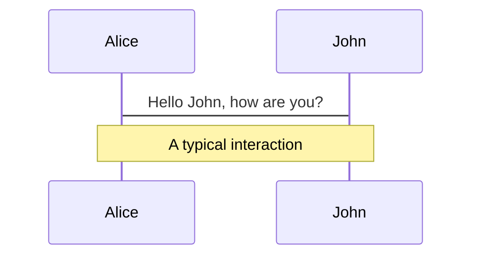
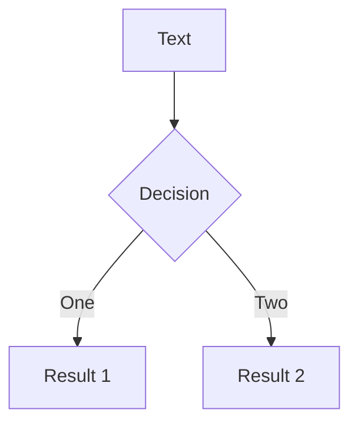

---
# try also 'default' to start simple
theme: seriph
# random image from a curated Unsplash collection by Anthony
# like them? see https://unsplash.com/collections/94734566/slidev
background: https://source.unsplash.com/collection/94734566/1920x1080
# apply any windi css classes to the current slide
class: 'text-center'
# https://sli.dev/custom/highlighters.html
highlighter: shiki
aspectRatio: '16/9'
download: true
# some information about the slides, markdown enabled
info: |
  ## Memocast Presentation Slides

  Learn more at [GitHub](https://github.com/TankNee/Memocast)
---

# Welcome to Memocast

An awesome wiz note client which was based on ELectron.

<div class="pt-12">
  <span @click="$slidev.nav.next" class="px-2 py-1 rounded cursor-pointer" hover="bg-white bg-opacity-10">
    Let's go! <carbon:arrow-right class="inline"/>
  </span>
</div>

<div class="abs-br m-6 flex gap-2">
  <a href="https://github.com/TankNee/Memocast" target="_blank" alt="GitHub"
    class="text-xl icon-btn opacity-50 !border-none !hover:text-white">
    <carbon-logo-github />
  </a>
</div>


<!--
The last comment block of each slide will be treated as slide notes. It will be visible and editable in Presenter Mode along with the slide. [Read more in the docs](https://sli.dev/guide/syntax.html#notes)
-->

---
layout: cover
class: text-center
---
# 获取演示并体验

只要连接了校园网，那么就可以通过以下链接获取到当前幻灯片

幻灯片链接: [Memocast Slide](http://10.16.83.27:3030)

---
layout: image-right
image: https://img.tanknee.cn/blogpicbed/2021/07/09/2021070995e5a81456071.png
---

# 团队成员

<div>
  <div style="display:flex;align-items:center;">
    
    <p>
      <span>倪桐珂</span>
    </p>
  </div>
  <div style="display:flex;align-items:center;">
    
    <p>
      <span>王格格</span>
    </p>
  </div>
  <div style="display:flex;align-items:center;">
    
    <p>
      <span>王怡贤</span>
    </p>
  </div>
  <!-- 
   -->
</div>


<br>
<br>

<!--
You can have `style` tag in markdown to override the style for the current page.
Learn more: https://sli.dev/guide/syntax#embedded-styles
-->

<style>
h1 {
  background-color: #2B90B6;
  background-image: linear-gradient(45deg, #4E25D4 10%, #146b8c 20%);
  background-size: 100%;
  -webkit-background-clip: text;
  -moz-background-clip: text;
  -webkit-text-fill-color: transparent; 
  -moz-text-fill-color: transparent;
}
</style>

---

<div align="center">
  
</div>

# Memocast 的起源

时间来到2021年，许多的笔记应用都支持了Markdown，但大多支持的并不够完整，或是缺少快捷的输入设置，或是不支持完整的Markdown语法，抑或是其他不尽人意的地方，因此我也借这个机会想要创造一款流畅优雅的笔记软件满足这一部分人的细分需求。

---

# 技术栈

<div style="display:flex;">
  <div style="display:flex;align-items:center;flex-direction:column;">
    
    <p>
      <span>Electron</span>
    </p>
  </div>
  <div style="display:flex;align-items:center;flex-direction:column;">
    
    <p>
      <span>Quasar</span>
    </p>
  </div>
  <div style="display:flex;align-items:center;flex-direction:column;">
    
    <p>
      <span>Vue</span>
    </p>
  </div>
  <!-- 
   -->
</div>

- 使用Electron构建桌面平台，支持 Windows、macOS、Linux，并使用 Electron-Builder 构建分发包，在 GitHub 提供升级服务器。同时借助Electron提供的能力为用户提供接近原生应用的体验（例如列表、文档树的上下文菜单）

- 使用Quasar UI Framework构建用户界面，实现统一的Material Design风格

- 使用Vue、Vuex、Vue Router生态构建页面框架，使用Vue-i18n实现用户界面、用户提示的多语言

---

# 设计思路

## 调研市面上的优秀笔记软件

Typora


---

# 设计思路

## Mark Text


---

# 设计思路

## 为知笔记


---

# 设计思路

## 原型图


---

# 确定需求与项目目标

| 需求名称         | 描述            |
| ------------ | ----------------------- |
| 用户注册         | 用户第一次使用时需要注册            |
| 用户登陆         | 用户需要登陆以使用软件             |
| 新建笔记         | 用户可以新建一个笔记              |
| 笔记修改         | 用户可以对笔记内容进行编辑           |
| 笔记排序         | 用户可以选择不同的方式对笔记进行排序      |
| Markdown实时渲染 | Markdown文档可以进行实时渲染      |
| 切换源代码模式      | 用户可以在实时渲染和源代码模式之间切换     |
| 快速插入         | 通过快捷方式插入图片等             |
| 笔记管理         | 用户对笔记进行管理               |
| 文件夹管理        | 用户可以建立文件夹并管理            |

---

# 确定需求与项目目标

| 需求名称         | 描述            |
| ------------ | ----------------------- |
| 标签管理         | 用户可以建立标签并管理             |
| 内容搜索         | 对所有笔记内容进行搜索             |
| 编辑器主题修改      | 编辑器的主题可以修改              |
| 多语言支持        | 软件语言可以在中文和英文之间切换        |
| 笔记锁定         | 笔记可以进行锁定，无法编辑           |
| 界面切换         | 软件界面可以在不同排布方式下切换        |
| 网络笔记导入       | 可以对微信、微博等网络笔记进行快捷导入     |
| 本地笔记导入       | 用户可以将本地的Markdown笔记导入编辑器 |
| 笔记导出         | 用户可以导出笔记到本地             |

---

# 确定需求与项目目标

| 需求名称         | 描述            |
| ------------ | ----------------------- |
| 快捷键          | 用户可以使用快捷键访问功能           |
| 软件更新         | 软件可以检查版本更新              |


---

# 项目结构

<div align="center">
  
</div>


---

# 项目结构

Hover on the bottom-left corner to see the navigation's controls panel, [learn more](https://sli.dev/guide/navigation.html)

### Keyboard Shortcuts

|     |     |
| --- | --- |
| <kbd>right</kbd> / <kbd>space</kbd>| next animation or slide |
| <kbd>left</kbd>  / <kbd>shift</kbd><kbd>space</kbd> | previous animation or slide |
| <kbd>up</kbd> | previous slide |
| <kbd>down</kbd> | next slide |

<!-- https://sli.dev/guide/animations.html#click-animations -->

<p v-after class="absolute bottom-23 left-45 opacity-30 transform -rotate-10">Here!</p>

---
layout: image-right
image: https://source.unsplash.com/collection/94734566/1920x1080
---

# Code

Use code snippets and get the highlighting directly![^1]

```ts {all|2|1-6|9|all}
interface User {
  id: number
  firstName: string
  lastName: string
  role: string
}

function updateUser(id: number, update: User) {
  const user = getUser(id)
  const newUser = {...user, ...update}  
  saveUser(id, newUser)
}
```

<arrow v-click="3" x1="400" y1="420" x2="230" y2="330" color="#564" width="3" arrowSize="1" />

[^1]: [Learn More](https://sli.dev/guide/syntax.html#line-highlighting)

<style>
.footnotes-sep {
  margin-top: 5em;
}
.footnotes {
  @apply text-sm opacity-75;
}
.footnote-backref {
  display: none;
}
</style>

---

# Components

<div grid="~ cols-2 gap-4">
<div>

You can use Vue components directly inside your slides.

We have provided a few built-in components like `<Tweet/>` and `<Youtube/>` that you can use directly. And adding your custom components is also super easy.

```html
<Counter :count="10" />
```

<!-- ./components/Counter.vue -->
<Counter :count="10" m="t-4" />

Check out [the guides](https://sli.dev/builtin/components.html) for more.

</div>
<div>

```html
<Tweet id="1390115482657726468" />
```

<Tweet id="1390115482657726468" scale="0.65" />

</div>
</div>


---
class: px-20
---

# Themes

Slidev comes with powerful theming support. Themes can provide styles, layouts, components, or even configurations for tools. Switching between themes by just **one edit** in your frontmatter:

<div grid="~ cols-2 gap-2" m="-t-2">

```yaml
---
theme: default
---
```

```yaml
---
theme: seriph
---
```


</div>

Read more about [How to use a theme](https://sli.dev/themes/use.html) and
check out the [Awesome Themes Gallery](https://sli.dev/themes/gallery.html).

---
preload: false
---

# Animations

Animations are powered by [@vueuse/motion](https://motion.vueuse.org/).

```html
<div
  v-motion
  :initial="{ x: -80 }"
  :enter="{ x: 0 }">
  Slidev
</div>
```

<div class="w-60 relative mt-6">
  <div class="relative w-40 h-40">
    
    
    
  </div>

  <div 
    class="text-5xl absolute top-14 left-40 text-[#2B90B6] -z-1"
    v-motion
    :initial="{ x: -80, opacity: 0}"
    :enter="{ x: 0, opacity: 1, transition: { delay: 2000, duration: 1000 } }">
    Slidev
  </div>
</div>

<!-- vue script setup scripts can be directly used in markdown, and will only affects current page -->
<script setup lang="ts">
const final = {
  x: 0,
  y: 0,
  rotate: 0,
  scale: 1,
  transition: {
    type: 'spring',
    damping: 10,
    stiffness: 20,
    mass: 2
  }
}
</script>

<div
  v-motion
  :initial="{ x:35, y: 40, opacity: 0}"
  :enter="{ y: 0, opacity: 1, transition: { delay: 3500 } }">

[Learn More](https://sli.dev/guide/animations.html#motion)

</div>

---

# LaTeX

LaTeX is supported out-of-box powered by [KaTeX](https://katex.org/).

<br>

Inline $\sqrt{3x-1}+(1+x)^2$

Block
$$
\begin{array}{c}

\nabla \times \vec{\mathbf{B}} -\, \frac1c\, \frac{\partial\vec{\mathbf{E}}}{\partial t} &
= \frac{4\pi}{c}\vec{\mathbf{j}}    \nabla \cdot \vec{\mathbf{E}} & = 4 \pi \rho \\

\nabla \times \vec{\mathbf{E}}\, +\, \frac1c\, \frac{\partial\vec{\mathbf{B}}}{\partial t} & = \vec{\mathbf{0}} \\

\nabla \cdot \vec{\mathbf{B}} & = 0

\end{array}
$$

<br>

[Learn more](https://sli.dev/guide/syntax#latex)

---

# Diagrams

You can create diagrams / graphs from textual descriptions, directly in your Markdown.

<div class="grid grid-cols-2 gap-10 pt-4 -mb-6">





</div>

[Learn More](https://sli.dev/guide/syntax.html#diagrams)


---
layout: center
class: text-center
---

# Learn More

[Documentations](https://sli.dev) · [GitHub](https://github.com/slidevjs/slidev) · [Showcases](https://sli.dev/showcases.html)
